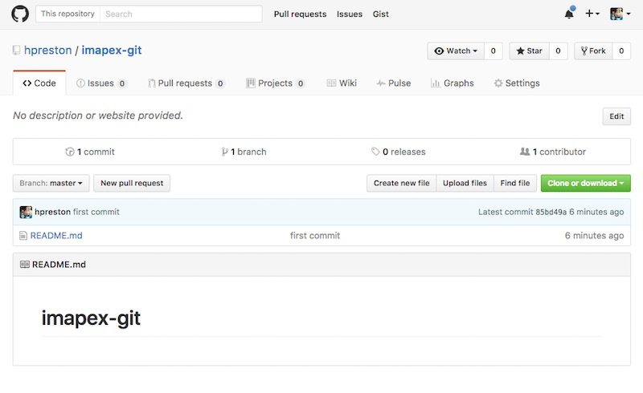
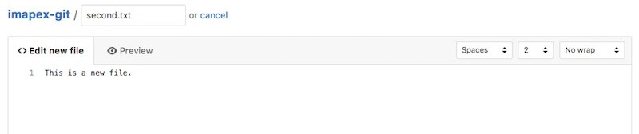
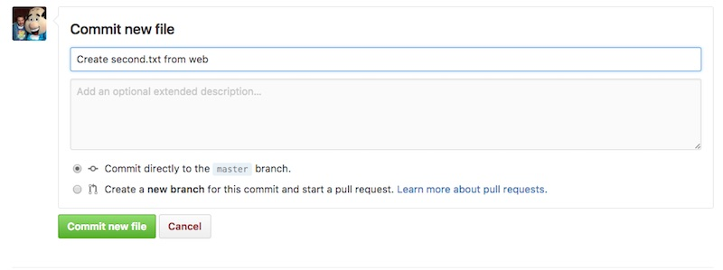
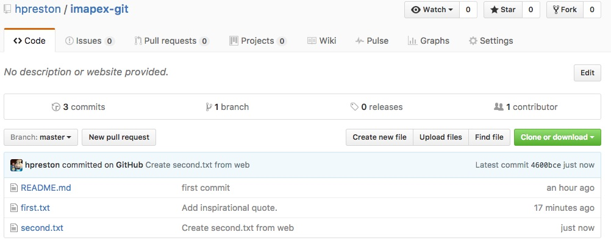

You can view this content in slideshow format at:

https://rawgit.com/imapex-training/mod_adv_git/master/slides/index.html#/

[item]: # (slide)


# Module: Advanced Git and GitHub

[item]: # (/slide)

## Abstract

Properly leveraging and navigating source control is critical to any developer working in a "modern" fashion.  Though there are many alternatives, git and GitHub remain the most popular and leveraged platforms for developers today.  Moving beyond the basics of repository creation, cloning, commiting and pushing can feel like learning an entirely new language.  However, successfully collaborating on projects require a solid skill set on branches, pull requests, issues, forking and managing remotes.  Not to mention how to react with the inevitable merge conflict.  We will cover all these topics and more in this hands-on module.  

[item]: # (slide)

## Agenda

* [Distributed Version Control](#distributed-version-control)
* [Git and GitHub Basics Refresher](#git-and-github-basics-refresher)
* [Handy Git Commands](#handy-git-commands)
* [Branches and More](#branches-and-more)
* [Forking and More](#forking-and-more)
* [Working With Others](#working-with-others)

[item]: # (/slide)

[item]: # (slide)

## Version Control 


[item]: # (/slide)

Version Control Systems (more than appending "v1, v2, v#" that is) are not new to development.  Solutions like subversion have existed that allow developers to work locally and easily commit and track changes to code bases over time.  

[item]: # (slide)

## Distributed Version Control 


[item]: # (/slide)

Git (and GitHub) are **Distributed** Version Control Systems.  The "Distributed" part indicates that the actual code base is not centralized to a single location.  In this solution, each developer maintains a "local" repository on their workstation where they can "commit" their work and changes.  Then they "push" the changes to a "remote" repository from which other developers can "pull" changes to their workstations.  

This distributed model enables teams of developers to more easily stay in sync with each other.  However, with multiple copies of the code base existing, there is a potential for conflicts to occure during the process of merging code together.  We will look at this potential and how to resolve during the lab session.  

[item]: # (slide)

## Client vs Server


### vs 


[item]: # (/slide)

Though often discussed like they are the same thing, **git** and **GitHub** are two different things, though tightly coupled.  

**git** is the Client application and specification for a distributed version control system.  

**GitHub** is a Server (or Service) providing Remote Repository services that leverages the git client and protocol.  In addition to simply providing remote repostiory storage for git users, GitHub also offers other development features to users that aren't specifically related to "git".  These include issue tracking, project management boards, metrics, etc.  

[item]: # (slide)

## Alternatives to GitHub


[item]: # (/slide)

Like many companeis before it (ie Xerox or Klenix), GitHub has basically become synomonous with "git" and is clearly the leading service for developers, however it isn't the only option for developers looking to host their code.  Some options include 

* [Gogs](http://gogs.io)
* [Phabricator](https://www.phacility.com/phabricator/)
* [BitBucket](https://bitbucket.org)
* [GitLab](http://gitlab.com)

[item]: # (slide)

## Alternative to git


[item]: # (/slide)

Just like GitHub isn't the only Service/Remote you can use, git isn't the only client a developer can leverage for version control.  Two other commonly used options are: 

* [Mercurial](https://www.mercurial-scm.org)
* [Subversion](https://subversion.apache.org)

Git (and GitHub) are the mostly commonly leveraged options however, and they will be what we cover in this module.  

[item]: # (slide)

# Exercises 

[item]: # (/slide)

[item]: # (slide)

## Git and GitHub Basics Refresher

Let's start by reviewing the basiscs of getting started with git and GitHub in an independent fashion.  

*We will assume you've already installed the `git` client software on your workstation*

[item]: # (/slide)

[item]: # (slide)

## Client Setup `git config`

```
git config --global user.name "Your Name Comes Here"
git config --global user.email you@yourdomain.example.com
```

[item]: # (/slide)

* So that you can get credit (or blame) for the work that you've contributed, you need to associate your name and email address with your work.  To do that in `git`, you use the `git config` command.

[item]: # (slide)

### Point of interest... what else can be configured 

```
$ git config -l

credential.helper=osxkeychain
filter.lfs.smudge=git-lfs smudge %f
filter.lfs.required=true
filter.lfs.clean=git-lfs clean %f
user.name=<YOUR NAME>
user.email=<YOUR EMAIL>
core.repositoryformatversion=0
core.filemode=true
core.bare=false
core.logallrefupdates=true
core.ignorecase=true
core.precomposeunicode=true
remote.origin.url=<REPO URL>
remote.origin.fetch=+refs/heads/*:refs/remotes/origin/*
branch.master.remote=origin
branch.master.merge=refs/heads/master
```

[item]: # (/slide)

[item]: # (slide)

## Creating a New Repo

**Options for Starting**

* Create on GitHub first
* Create locally first

[item]: # (/slide)

Both work, there is no "right" or "wrong" way to do it, however the "simpler" method would be to create on GitHub first.  

However, there is no requirement that you leverage a remote server like GitHub.  If you are the only developer, and have no interest in sharing your work with others you could only work locally.  This is **not** the typical usage of git, so we will will assume you plan to share your code on GitHub.  

[item]: # (slide)

### Option: GitHub First

* Navigate to [github.com](http://github.com), login and click "New repository"


[item]: # (/slide)

[item]: # (slide)

* Name your repository `imapex-git`.  Provide a description, make it Public, but do **not** initialize with a README


[item]: # (/slide)

[item]: # (slide)

* You now have an empty repository on GitHub and are shown three options for starting out


[item]: # (/slide)

The first option is for a truly new project where no code exists.  You can simply copy and paste the commands displayed into a terminal window (you should already be in a directory where you want your code to be located) to get started.  

The second option is when you already created a git repostiory locally and want to link it to the remote repository you just created.  

The last option would allow you to import code from a non-git project.  

[item]: # (slide)

* Create a local directory for your project (hint: name your directory the same as your repository name)

```
# Enter your base code directory 
cd ~/coding 

mkdir imapex-git
cd imapex-git
```

[item]: # (/slide)

[item]: # (slide)

* Copy and Paste the commands from the GitHub window.  **DO NOT just copy from the lab.  You need your own repository, not mine**

```
echo "# imapex-git" >> README.md
git init
git add README.md
git commit -m "first commit"
git remote add origin https://github.com/hpreston/imapex-git.git
git push -u origin master
```

[item]: # (/slide)

What these commands do: 

* `echo "# imapex-git" >> README.md`
    * Create a new text file called "README.md" with the contents "# imapex-git"
* `git init`
    * Initilizea a local git repostory in the current directory
* `git add README.md`
    * Add the "README.md" file to the repository
* `git commit -m "first commit"`
    * Commit the changes (the README file) locally
* `git remote add origin https://github.com/hpreston/imapex-git.git`
    * Link the remote repository on GitHub to your local version
    * "origin" is an alias for the remote repository.  You could name it anything, but convention is to use "origin"
* `git push -u origin master`
    * Send your local changes (ie commits) to GitHub

[item]: # (slide)

* Your final output should be

```
Counting objects: 3, done.
Writing objects: 100% (3/3), 228 bytes | 0 bytes/s, done.
Total 3 (delta 0), reused 0 (delta 0)
To https://github.com/hpreston/imapex-git.git
 * [new branch]      master -> master
Branch master set up to track remote branch master from origin.
```

[item]: # (/slide)

[item]: # (slide)

* Refresh the GitHub page and now you'll see your repository has been updated.  



[item]: # (/slide)

There is now a copy of your repositroy (granted, there isn't much in there yet) on GitHub that matches your local copy.  If you had checked the box to "Initialize with a README" when creating it originally, you would have the same result.  

[item]: # (slide)

* With the remote copy, let's delete the local copy

```
cd ..
rm -Rf imapex-git

ls -la imapex-git
```
```
# Output 
ls: imapex-git: No such file or directory
```

[item]: # (/slide)

[item]: # (slide)

* Use `git clone` to create a new local copy from GitHub.  **(DO NOT copy and paste from the lab, you need to update the URL for your own GitHub Username)**

```
git clone https://github.com/hpreston/imapex-git
```
```
# Output 
Cloning into 'imapex-git'...
remote: Counting objects: 3, done.
remote: Total 3 (delta 0), reused 3 (delta 0), pack-reused 0
Unpacking objects: 100% (3/3), done.
```

[item]: # (/slide)

[item]: # (slide)

* Move to the directory and look at the contents 

```
cd imapex-git 
ls -la 
```
```
# Output
total 8
drwxr-xr-x   4 hapresto  wheel   136 Jan  5 14:15 .
drwxrwxrwt  32 root      wheel  1088 Jan  5 14:15 ..
drwxr-xr-x  13 hapresto  wheel   442 Jan  5 14:15 .git
-rw-r--r--   1 hapresto  wheel    13 Jan  5 14:15 README.md
```

[item]: # (/slide)

The `.git` directory is the actual repository informaiton locally.  The `.git/config` file has interesting information in it.  

[item]: # (slide)

* Look at the contents of the `.git/config` file

```
cat .git/config
```
```
# Output
[core]
	repositoryformatversion = 0
	filemode = true
	bare = false
	logallrefupdates = true
	ignorecase = true
	precomposeunicode = true
[remote "origin"]
	url = https://github.com/hpreston/imapex-git
	fetch = +refs/heads/*:refs/remotes/origin/*
[branch "master"]
	remote = origin
	merge = refs/heads/master
```

[item]: # (/slide)

Note the `[remote "origin"]` and `[branch "master"]` sections.  These indicate the key concepts related to the Distributed Version Control System is leveraged.  Branches will be discussed more later in the lab.  

[item]: # (slide)

## The Development Process

With the new repository created, we can begin to actually code.  A couple of key points: 

* Development is a continuing cycle of **Code -> Add -> Commit -> Push**
* Keep the mantra "Commit early, commit often" in mind
    * Small commits preferred over large commits
* Commits can be seen as "undo points"

[item]: # (/slide)

[item]: # (slide)

### Code

* Create a file `first.txt`.

```
touch first.txt
```

[item]: # (/slide)

[item]: # (slide)


* Open `first.txt` in a text editor, and add the message: `Our best thoughts came from others.`

    ***Feel free to use whatever text editor you prefer to do this***

* Look at the current contents of the file

```
cat first.txt 
```
```
# Output
Our best thoughts came from others.
```

[item]: # (/slide)

[item]: # (slide)

* Check the status

```
git status
```
``` 
# Output
On branch master

Initial commit

Untracked files:
  (use "git add <file>..." to include in what will be committed)

	first.txt

nothing added to commit but untracked files present (use "git add" to track)
```

[item]: # (/slide)

As you can see, `git` recognizes that there is a new file in the directory, and it knows that it's not being tracked.  

[item]: # (slide)

### Add

* Add `first.txt` to "stage" your work.  

```
git add first.txt
```

[item]: # (/slide)

An important concept in `git` is the "stage".  The "stage" is an intermediate phase where you can assemble your changes before you then "commit" your work.  This also allows you (if you like) to stage small modifications to the same file as you work on it.

[item]: # (slide)

* Execute `git status` again.  You should see the following:

```
# Output
On branch master

Initial commit

Changes to be committed:
  (use "git rm --cached <file>..." to unstage)

	new file:   first.txt
```

[item]: # (/slide)

Okay, you'll notice that there are now "staged" changes in the form of `new file:   first.txt`

[item]: # (slide)

### Commit

* Commit your changes

``` 
git commit -m "Add inspirational quote."
```
```
# Output
[master fdb6a07] Add inspirational quote.
 1 file changed, 1 insertion(+)
 create mode 100644 first.txt
```

[item]: # (/slide)
 
In order to store your changes in your git repo, you need to commit them.  Now that you have staged changes, you commit them by executing `git commit -m "Add inspirational quote"`.  The `-m "<message>"` is used to add a description of your changes in a human readable form.  As you gain experience with git, there are a lot of opinionated folks out there who can help you write excellent commit messages.  For now, we'll just keep it simple and move ahead.

Note that the number and letter combination `7be53cc` contained in `[master (root-commit) 7be53cc]`.  Yours will be different than the ones in this tutorial.  Git uses a SHA1 hash to file away your changes.  When someone asks you, "What's your commit hash?", this is the number they are asking for!


[item]: # (slide)

* Type `git status` again.  You will see git reply with:

```
On branch master
Your branch is ahead of 'origin/master' by 1 commit.
  (use "git push" to publish your local commits)
nothing to commit, working tree clean
```

[item]: # (/slide)

Here we can see that we have "nothing to commit", but we are "ahead of origin/master by 1 commit".  This indicates that we have made local changes that aren't reflected on the remote server.  

[item]: # (slide)

### Push

* Push your changes

```
git push
```
```
# Output
Counting objects: 3, done.
Delta compression using up to 8 threads.
Compressing objects: 100% (2/2), done.
Writing objects: 100% (3/3), 327 bytes | 0 bytes/s, done.
Total 3 (delta 0), reused 0 (delta 0)
To https://github.com/hpreston/imapex-git
   85bd49a..fdb6a07  master -> master
```   

[item]: # (/slide)

[item]: # (slide)

* Type `git status` again.  You will see git reply with:

```
On branch master
Your branch is up-to-date with 'origin/master'.
nothing to commit, working tree clean
```

[item]: # (/slide)

Now our local and remote copies of the repository are in sync.  If another developer were working on our project with us, they could `git pull` to retrieve our changes.  More on this next.  

[item]: # (slide)

## `git pull`


[item]: # (/slide)

"Pulling" changes is most relevant when working collaboratively on a project and not something you'll do often if you are working independently.  However, it is a basic feature of git that should be understood by anyone using it.  

In order to demonstrate it here, we'll do something a little unusual.  

[item]: # (slide)

* In the GitHub Repository, create a new file.  


[item]: # (/slide)

[item]: # (slide)

* Name the file `second.txt`, and add the text `This is a new file.`



[item]: # (slide)

* Scroll down and Commit the file.  Provide a description of `Create second.txt from web`



[item]: # (/slide)

[item]: # (slide)

* You'll now see that the remote repository on GitHub has both `first.txt` and `second.txt` 



[item]: # (/slide)

[item]: # (slide)

* Back on your local workstation, verify that you do NOT have second.txt locally with `ls -l` 

```
# Output
total 16
-rw-r--r--  1 hapresto  wheel  13 Jan  5 14:15 README.md
-rw-r--r--  1 hapresto  wheel  36 Jan  5 14:33 first.txt
```

[item]: # (/slide)

[item]: # (slide)

* Execute `git pull` to retrieve the remote changes

```
# Output
remote: Counting objects: 3, done.
remote: Compressing objects: 100% (2/2), done.
remote: Total 3 (delta 0), reused 0 (delta 0), pack-reused 0
Unpacking objects: 100% (3/3), done.
From https://github.com/hpreston/imapex-git
   fdb6a07..4600bce  master     -> origin/master
Updating fdb6a07..4600bce
Fast-forward
 second.txt | 1 +
 1 file changed, 1 insertion(+)
 create mode 100644 second.txt
```

[item]: # (/slide)

[item]: # (slide)

* Verify `second.txt` was created

```
cat second.txt
```
```
# Output
This is a new file.
```

[item]: # (/slide)


[item]: # (slide)

## Handy Git Commands

* `git status`
* `git log`
* `git diff`
* `git reset`

[item]: # (/slide)

[item]: # (slide)

### `git status` 

```
$ git status -h

usage: git status [<options>] [--] <pathspec>...

    -v, --verbose         be verbose
    -s, --short           show status concisely
    -b, --branch          show branch information
    --porcelain           machine-readable output
    --long                show status in long format (default)
    -z, --null            terminate entries with NUL
    -u, --untracked-files[=<mode>]
                          show untracked files, optional modes: all, normal, no. (Default: all)
    --ignored             show ignored files
    --ignore-submodules[=<when>]
                          ignore changes to submodules, optional when: all, dirty, untracked. (Default: all)
    --column[=<style>]    list untracked files in columns
```

[item]: # (/slide)

`git status` is used to check the current status of the working environment compared to the local and remote repositories.  

[item]: # (slide)

#### Some examples we've seen

* Untracked Files 

```
$ git status

# Output
On branch master

Initial commit

Untracked files:
  (use "git add <file>..." to include in what will be committed)

	first.txt

nothing added to commit but untracked files present (use "git add" to track)
```

[item]: # (/slide)

Untracked Files indicate files that exist in the working directory, but have not been `git add`ed yet.  

[item]: # (slide)

* Changes staged

```
# Output
On branch master

Initial commit

Changes to be committed:
  (use "git rm --cached <file>..." to unstage)

	new file:   first.txt
```

[item]: # (/slide)

[item]: # (slide)

* Locally Repository ahead of Remote Repository

```
On branch master
Your branch is ahead of 'origin/master' by 1 commit.
  (use "git push" to publish your local commits)
nothing to commit, working tree clean
```

[item]: # (/slide)

[item]: # (slide)

* Local and Remote Repostiries in sync 

```
On branch master
Your branch is up-to-date with 'origin/master'.
nothing to commit, working tree clean
```

[item]: # (/slide)

[item]: # (slide)

### `git log`

```
$ git log -h
usage: git log [<options>] [<revision-range>] [[--] <path>...]
   or: git show [<options>] <object>...

    -q, --quiet           suppress diff output
    --source              show source
    --use-mailmap         Use mail map file
    --decorate[=...]      decorate options
    -L <n,m:file>         Process line range n,m in file, counting from 1
```

[item]: # (/slide)

`git log` displays the commit history.  

[item]: # (slide)

* Execute `git log` 

```
commit 4600bcecad83434ee50cf35e5697842e0f10faf0
Author: Hank Preston <hank.preston@gmail.com>
Date:   Thu Jan 5 14:56:40 2017 -0500

    Create second.txt from web

commit fdb6a077bfa19495d3238589b8c89a72cca0a24e
Author: Hank Preston <hank.preston@gmail.com>
Date:   Thu Jan 5 14:39:25 2017 -0500

    Add inspirational quote.

commit 85bd49a1dce5983a7128f489f43cfc510ffad2f3
Author: Hank Preston <hank.preston@gmail.com>
Date:   Thu Jan 5 14:03:34 2017 -0500

    first commit
```

[item]: # (/slide)

#### Sidebar: Short hash vs. full hash

In our previous step, we looked at the commit has that git presented to us: `7be53cc`.  You should notice that `7be53cc` is the first 7 characters of the full commit hash above: `7be53cc330db1207c9b26fe560704f90405742fd`.

[item]: # (slide)

### `git diff`

```
$ git diff -h
usage: git diff [<options>] [<commit> [<commit>]] [--] [<path>...]
```

[item]: # (/slide)

`git diff` describes the changes from one commit to another.  Provide either the long or short hash to specify specific commits, with the first commit being the "starting point" you are interested in.  

If you do NOT specify commits, the command shows differences between the last commit and the current working copy.  

[item]: # (slide)

* Pick two of your listed commits and run `git diff` on them.  

```
$ git diff 85bd49a1dce5983a7128f489f43cfc510ffad2f3 fdb6a077bfa19495d3238589b8c89a72cca0a24e

diff --git a/first.txt b/first.txt
new file mode 100644
index 0000000..d4425d9
--- /dev/null
+++ b/first.txt
@@ -0,0 +1 @@
+Our best thoughts came from others.
```

[item]: # (/slide)

[item]: # (slide)

### `git reset`

```
$ git reset -h

usage: git reset [--mixed | --soft | --hard | --merge | --keep] [-q] [<commit>]
   or: git reset [-q] <tree-ish> [--] <paths>...
   or: git reset --patch [<tree-ish>] [--] [<paths>...]

    -q, --quiet           be quiet, only report errors
    --mixed               reset HEAD and index
    --soft                reset only HEAD
    --hard                reset HEAD, index and working tree
    --merge               reset HEAD, index and working tree
    --keep                reset HEAD but keep local changes
    -p, --patch           select hunks interactively
    -N, --intent-to-add   record only the fact that removed paths will be added later
```

[item]: # (/slide)

Occasionally you may find yourself having done some coding that didn't really work out how you hoped.  Or you may mistakenly delete something that you wish you hadn't.  If you are following the "commit early, commit often" mantra, this doesn't have to be a big deal.  

`git reset` enables you to go back in time to a particular commit, immediately wiping out any changes you've made.  There are a whole lot of options available, but we'll look at the one that does a "hard" reset.  

[item]: # (slide)

* Open up `first.txt` and add the line `This is all a mistake.`  To the end.  

```
$ cat first.txt

Our best thoughts came from others.
This is all a mistake.
```

[item]: # (/slide)

[item]: # (slide)

* Use `git status` to verify that the file has been modified.

```
On branch master
Your branch is up-to-date with 'origin/master'.
Changes not staged for commit:
  (use "git add <file>..." to update what will be committed)
  (use "git checkout -- <file>..." to discard changes in working directory)

	modified:   first.txt

no changes added to commit (use "git add" and/or "git commit -a")
```

[item]: # (/slide)

[item]: # (slide)

* Use `git log` to find the hash of your most recent commit

```
commit 4600bcecad83434ee50cf35e5697842e0f10faf0
Author: Hank Preston <hank.preston@gmail.com>
Date:   Thu Jan 5 14:56:40 2017 -0500

    Create second.txt from web
```

[item]: # (slide)

* Execute `git reset --hard 4600bcecad83434ee50cf35e5697842e0f10faf0` to undo the changes.  **(Use your commit hash in the command)**

```
HEAD is now at 4600bce Create second.txt from web
```

[item]: # (/slide)

[item]: # (slide)

* Verify the changes are gone

```
$ cat first.txt

Our best thoughts came from others.
```

[item]: # (/slide)

[item]: # (slide)

## Branches and More

* `git branch`
* `git merge`
* `git stash`
* `git tag`

[item]: # (/slide)

In this section we'll look at some of the options available for not breaking working code.  Or in other words, how developers can work on new features, fix bugs, or experiment in a low risk fashion.  

[item]: # (slide)

## Code Branches 

* Used to develop features
* isolate changes
* repos maintain a default branch, usually master
* can be merged into other branches

[item]: # (/slide)

Let's say you have a new feature that you're working on.  You might have to refactor some of your code, and you want to be able to checkin your changes as you make progress.  However, you don't want to box yourself in a corner and prevent easy changes to your production code.  In order to manage this type of situation, you need to isolate your changes, and so you should use `git` branching.

[item]: # (slide)

### `git branch <branch name>` 

```
$ git branch -h

usage: git branch [<options>] [-r | -a] [--merged | --no-merged]
   or: git branch [<options>] [-l] [-f] <branch-name> [<start-point>]
   or: git branch [<options>] [-r] (-d | -D) <branch-name>...
   or: git branch [<options>] (-m | -M) [<old-branch>] <new-branch>
   or: git branch [<options>] [-r | -a] [--points-at]

Generic options
    -v, --verbose         show hash and subject, give twice for upstream branch
    -q, --quiet           suppress informational messages
    -t, --track           set up tracking mode (see git-pull(1))
    --set-upstream        change upstream info
    -u, --set-upstream-to <upstream>
                          change the upstream info
    --unset-upstream      Unset the upstream info
    --color[=<when>]      use colored output
    -r, --remotes         act on remote-tracking branches
    --contains <commit>   print only branches that contain the commit
    --abbrev[=<n>]        use <n> digits to display SHA-1s

Specific git-branch actions:
    -a, --all             list both remote-tracking and local branches
    -d, --delete          delete fully merged branch
    -D                    delete branch (even if not merged)
    -m, --move            move/rename a branch and its reflog
    -M                    move/rename a branch, even if target exists
    --list                list branch names
    -l, --create-reflog   create the branch's reflog
    --edit-description    edit the description for the branch
    -f, --force           force creation, move/rename, deletion
    --merged <commit>     print only branches that are merged
    --no-merged <commit>  print only branches that are not merged
    --column[=<style>]    list branches in columns
    --sort <key>          field name to sort on
    --points-at <object>  print only branches of the object
```

[item]: # (/slide)

What that does is to allow you to make changes in an area that won't affect the `master` branch.  One convention in `git` is that the main branch is typically named `master`.

Now you're basically operating in a parallel universe until you merge your changes back into `master`.

[item]: # (slide)

* Create a new branch called "shakespeare"

```
git branch shakespeare
git branch
```
```
# Output
* master
  shakespeare
```

[item]: # (/slide)

[item]: # (slide)

* Now, you need to switch to your branch.

```
git checkout shakespeare
```
```
# Output 
Switched to branch 'shakespeare'
```

[item]: # (/slide)

[item]: # (slide)

* You can shorten this into a single command with the `-b` flag for `git checkout`

```
git checkout -b chaucer
git branch
```
```
# Output #1
Switched to a new branch 'chaucer'
```
```
# Output #2
* chaucer
  master
  shakespeare
```

[item]: # (/slide)

[item]: # (slide)

* We didn't really want a chaucer branch though, switch back to shakespeare and delete chaucer

```
git checkout shakespeare
git branch -d chaucer
git branch
```
```
# Output #1
Switched to branch 'shakespeare'
```
```
# Output #2
Deleted branch chaucer (was 4600bce).
```
```
# Output #3
  master
* shakespeare
```

[item]: # (/slide)

[item]: # (slide)

* Add some text to your `first.txt` with some text from Shakespeare.  `To be or not to be, that is the question!`

```
$ cat first.txt

Our best thoughts came from others.
To be or not to be, that is the question!
```

[item]: # (/slide)

[item]: # (slide)

* Complete your code change by adding and committing your change.  

```
git add first.txt
git commit -m "Added To be or not to be"
```

[item]: # (/slide)

[item]: # (slide)

* Push your new branch to GitHub

```
git push -u origin shakespeare
```
```
# Output

Counting objects: 3, done.
Delta compression using up to 8 threads.
Compressing objects: 100% (3/3), done.
Writing objects: 100% (3/3), 389 bytes | 0 bytes/s, done.
Total 3 (delta 0), reused 0 (delta 0)
To https://github.com/hpreston/imapex-git
 * [new branch]      shakespeare -> shakespeare
Branch shakespeare set up to track remote branch shakespeare from origin.
```

[item]: # (/slide)

The first time you push a new branch to GitHub you need to use the option `-u` to "set-upstream" for the branch.  What the command says is "Please push the current working branch up to the remote I call 'origin' and create a new branch there called 'shakespeare'".  

It is important to understand that though it is good practice, it is **not** required that the name of a branch be the same in local and remote repositories.  If you were to use a command like `git push -u origin bob`, you would create a new branch in the GitHub instance of the repository called "bob" that was linked with yoru local branch called "shakespeare".  

Where this typically becomes a problem is if you use the command `git push -u origin master` from within a branch.  This will result in your local branch being linked to the `master` branch on GitHub.  Not something every done intentionally.  

[item]: # (slide)

* Take a look at `.git/config` to see what this linkage looks like.  

```
$ cat .git/config

[core]
	repositoryformatversion = 0
	filemode = true
	bare = false
	logallrefupdates = true
	ignorecase = true
	precomposeunicode = true
[remote "origin"]
	url = https://github.com/hpreston/imapex-git
	fetch = +refs/heads/*:refs/remotes/origin/*
[branch "master"]
	remote = origin
	merge = refs/heads/master
[branch "shakespeare"]
	remote = origin
	merge = refs/heads/shakespeare
```

[item]: # (/slide)

[item]: # (slide)

* Add another quote to `first.txt`.  This time add "Out, damned spot! Out, I say!"
* Add and Commit this change as well.  

```
git add first.txt
git commit -m "Added Lady Macbeth Quote."
```

[item]: # (/slide)

[item]: # (slide)

* Push this change to GitHub, but this time you can just use `git push` without the option.  

```
$ git push 

Counting objects: 3, done.
Delta compression using up to 8 threads.
Compressing objects: 100% (3/3), done.
Writing objects: 100% (3/3), 413 bytes | 0 bytes/s, done.
Total 3 (delta 0), reused 0 (delta 0)
To https://github.com/hpreston/imapex-git
   53c1785..3bf82d8  shakespeare -> shakespeare
```

[item]: # (/slide)

[item]: # (slide)

* Change back to master

```
git checkout master
```

[item]: # (/slide)

[item]: # (slide)

* Verify that the new change does **not** exist in the master branch

```
$ cat first.txt

Our best thoughts came from others.
```

[item]: # (/slide)

[item]: # (slide)

### `git merge` 

```
$ git merge -h
usage: git merge [<options>] [<commit>...]
   or: git merge [<options>] <msg> HEAD <commit>
   or: git merge --abort

    -n                    do not show a diffstat at the end of the merge
    --stat                show a diffstat at the end of the merge
    --summary             (synonym to --stat)
    --log[=<n>]           add (at most <n>) entries from shortlog to merge commit message
    --squash              create a single commit instead of doing a merge
    --commit              perform a commit if the merge succeeds (default)
    -e, --edit            edit message before committing
    --ff                  allow fast-forward (default)
    --ff-only             abort if fast-forward is not possible
    --rerere-autoupdate   update the index with reused conflict resolution if possible
    --verify-signatures   verify that the named commit has a valid GPG signature
    -s, --strategy <strategy>
                          merge strategy to use
    -X, --strategy-option <option=value>
                          option for selected merge strategy
    -m, --message <message>
                          merge commit message (for a non-fast-forward merge)
    -v, --verbose         be more verbose
    -q, --quiet           be more quiet
    --abort               abort the current in-progress merge
    --allow-unrelated-histories
                          allow merging unrelated histories
    --progress            force progress reporting
    -S, --gpg-sign[=<key-id>]
                          GPG sign commit
    --overwrite-ignore    update ignored files (default)
```

[item]: # (/slide)

With `git merge` you can add commits from one branch into another branch.  This is typically done as part of integration testing, and when the time comes to incorporate new features or fixes into the main "master" branch.  

[item]: # (slide)

### `git merge` in asci art

```
	  A---B---C feature
	 /         \
 D---E---F---G---H master
```

[item]: # (/slide)

[item]: # (slide)

* Merge the shakespeare branch into master 

```
git merge shakespeare
```
```
# Output
Updating 4600bce..3bf82d8
Fast-forward
 first.txt | 2 ++
 1 file changed, 2 insertions(+)
```

[item]: # (/slide)

[item]: # (slide)

* Verify the updates were made to `first.txt`

```
$ cat first.txt

Our best thoughts came from others.
To be or not to be, that is the question!
Out, damned spot! Out, I say!
```

[item]: # (/slide)

[item]: # (slide)

* With the changes merged in, delete the branch

```
git branch -d shakespeare
```
```
# Output

Deleted branch shakespeare (was 3bf82d8).
```

[item]: # (/slide)

[item]: # (slide)

* Push your changes up to GitHub

```
git push
```
```
# Output
Total 0 (delta 0), reused 0 (delta 0)
To https://github.com/hpreston/imapex-git
   4600bce..3bf82d8  master -> master
```

[item]: # (/slide)

Notice in the output that there is no reference to deleting the shakespeare branch on the remote.  

[item]: # (slide)

* Push the deleted branch change to GitHub

```
git push origin --delete shakespeare
```
```
# Output

To https://github.com/hpreston/imapex-git
 - [deleted]         shakespeare
```

[item]: # (/slide)

[item]: # (slide)

### Foreshadowing: Merge Conflicts

[item]: # (/slide)

It won't be long before you attempt a `git merge` and encounter the dreaded "merge conflict" alert.  This happens whenever two commits are making changes to the same part (ie line) of a file.  There is nothing wrong with two commits working on the same file, but if the same line has been edited this is not something git can automatically work through.  

Though this can occur when working independently on a project, it is much more common when working collaboratively with others.  We will discuss and experiment with conflicts later in the lab when looking at collaborative development topics.  

## Forking and More


## Working With Others


--------------------------------------
# Original Content

--------------------------------------


[item]: # (slide)

## Introduction

This module will provide you with an introduction to some basic to intermediate github workflows.

It is assumed that you already have a basic understanding of:

* What git is
* When/why you would use it


The official tutorial for Github is a useful resource and can be find [Here](https://guides.github.com/activities/hello-world/)

[item]: # (/slide)
[item]: # (slide)
## Basic Refresher

There are three states in a github repo.

* Modified - any files that you have modified in your working directory
* Staged - a snapshot of files, ready to be commited
* Commited - permentantly stored in your git repository

[item]: # (/slide)

[item]: # (slide)
## "Checkout"
The ability to move your current working directory to a point in time.

This is a point in time in time at a particular branch.

To see the git history you can use:

```
git log
```

To work on the code from a specific point in time

```
git checkout <COMMIT>
```

[item]: # (/slide)

[item]: # (slide)
## Other commands to try

Show commit info + files that changed
```
git log --stat
```
A single line view of each commit
```
git log --pretty=oneline
```
To compare two commits
```
git diff commit1 commit2
```

[item]: # (/slide)

[item]: # (slide)
## Tags

* reference to a specific commit
* human friendly
* typically used for managing releases
Show Tags:
```
git tag
```
Create a new tag:
```
git tag -a v1.0 -m "version 1.0 release"
```
Tag a previous commit:
```
git tag -a v1.2 9fcd202
```

[item]: # (/slide)

[item]: # (slide)
## HEAD

* The latest commit in a particular branch.
* used as a reference when checking out a particular branch

You can see what the latest commit is with
```
cat .git/HEAD
```

[item]: # (/slide)
## Forking / Branching

Forking and Branching are mechanisms used by Git to diverge from the main code line for feature development, or bug
fixes. Branches are seperate trains within the same repository, whereas a fork, creates a copy of the entire repository in
a different location (user account). From the perspective of a single developer the two are very similar, however, it
is important to consider what other developers are doing relative to the project. The fork based workflow is dominant in
opensource projects as contributors likely would not have access to push code to the main repository.

For more information see this [Stack Overflow Post](http://stackoverflow.com/questions/3611256/forking-vs-branching-in-github)
[item]: # (slide)

## Branches

* Used to develop features
* isolate changes
* repos maintain a default branch, usually master
* can be merged into other branches
Create a new branch:
```
git branch -m mynewfeature
```


[item]: # (/slide)
[item]: # (slide)
## Forking

* a copy of a repository
* make changes w/o impacting source repo
* long lived
  * a new project based on existing work
* short lived
  * proposing changes to someone elses repo

[Tell me more!!](https://help.github.com/articles/working-with-forks/)

[item]: # (/slide)

[item]: # (slide)
## Stashing

* moves changes out of the staging area temporarily
* useful when navigating between branches
* create a tempory "stash" of **staged** files
* apply them to another branch

Stash Changes:
```
git stash
```

Unstash Changes:
```
git stash apply
```

List Stashed changes:
```
git stash list
```

[Tell me more!!](https://git-scm.com/book/en/v1/Git-Tools-Stashing)

[item]: # (/slide)

Stashing provides ability to temporarily store local changes prior to performing other operations on the
repository - a good example of this is that you've been working on some changes and want to pull the latest changes that
others have committed.

*NOTE* One important thing to remember is that git stash will not save files in the working directory unless they have been
added to the index (git add)

A detailed explanation of git stash can be found [Here](https://git-scm.com/book/en/v1/Git-Tools-Stashing)


[item]: # (slide)
## Merge

* incorporate changes between branches


```
	  A---B---C feature
	 /
 D---E---F---G master
```

```
git checkout master
git merge feature
```

```
	  A---B---C feature
	 /         \
 D---E---F---G---H master
```
To undo a merge that has conflicts:
```
git merge --abort
```


[item]: # (/slide)

[item]: # (slide)
## Rebase

* another way to merge changes between branches
* apply all commits from one branch to another
* syncing changes to a a feature branch


[item]: # (/slide)
[item]: # (slide)
## Remotes

A git repo may have many copies in various locations called remotes:

* URL reference to other copies of the repository
* most commonly github
* `origin` - automatically created remote when a repo is cloned
To view remotes configuration
```
cat .git/config
```
To add additional remote:
```
git add remote <name> <url>
```
Additional remote operations:

```
git remote --help
```

[item]: # (/slide)

[item]: # (slide)
## Push
Push your local changes to a remote:
```
git push <remote> <branch>
```
* when used w/ multiple remotes you can quickly work across branches and forks

[item]: # (/slide)
[item]: # (slide)

## Pull Requests

Pull requests are the way of notifying others about changes that you've checked in and you want incorporated into the
main project.  Pull requests can be issued from a forked repository, or from a branch within a single repository.

* notify others of your changes
* request that they "pull" those changes into their work and merge them
* issued from:
  * forked repository
  * branches in the same repository

[item]: # (/slide)
[item]: # (slide)

## Issues / Milestones / Labels

Issues are an important collaboration tool within github

Issues allow you to
* Keep track of bugfixes
* Track enhancements
* Provide a forum for discussion about your code
  * supports github flavored markdown for references to PR's, code, mentions, etc

Asignment, Milestones and Labels allow you to organize issues in a meaningful way

[item]: # (/slide)


Issues are the primary vehicle by which feature enhancements and bug fixes are tracked.

Labels are used to categorize the the issue. Examples of tags are enhancement, bug, question, help wanted.

 A detailed explanation of Issues, Labels, and Milestones can be found [Here](https://guides.github.com/features/issues/)

*TIP:* To close an issue in the same repository, use one of the keywords in the list below followed by a
reference to the issue number in the commit message. For example, a commit message with Fixes #45 will close issue 45
in that repository once the commit is merged into the default branch.

If the commit is in a non-default branch, the issue will remain open and the issue will be referenced with a tooltip.

For more information and similar tips see [https://help.github.com/articles/closing-issues-via-commit-messages/]


README Standards and Expectations
----------------------------------

A good README file is important for outlining the motivation behind a particular project repository, as well
as providing the reader with an overview of how to effectively utilize the project repository.


[http://stackoverflow.com/questions/2304863/how-to-write-a-good-readme](http://stackoverflow.com/questions/2304863/how-to-write-a-good-readme)


* ASCII characters only, if the README is written in English
* write it in English if possible, and ship translated version with two-letter
  language code extension like README.ja
* 80 characters or less per line
* single empty line between paragraphs
* dashes under the headers
* indent using whitespace (0x20) not tab


[item]: # (slide)

## Discussion Items for kickoff

* Production deployments will be done from the master branch
* All feature development should be done via the developers fork / branch
* All feature development should have an open issue tagged enhancement for tracking purposes
* All bug fixes should have an open issue for tracking purposes

[item]: # (/slide)

[item]: # (slide)

## Sample Workflow

1. Fork an existing repository
2. Clone your fork
3. Add 'upstream' remote
4. Create a feature branch
5. develop cool feature
6. incorporate any upstream changes to your fork / branch
7. merge your feature branch
8. Open pull request to existing repostiory

[item]: # (/slide)

Lab Exercise
=============================

For the lab exercise of this module we will be combining these steps into a real-world workflow.


# Instructions

1. Open an Issue against the imapex/101-github-lab referencing the fact that your email is missing from the CONTRIBUTORS.txt
file. As you are now going to be contributing to the project - this is obviously and enhancement, so label it as such!!!

2. Assign yourself to the issue

3. Create a fork of your /101-github-lab repository

	```
   git clone https://github.com/<your_git_id>/101-github-lab
   ```

4. Now that we have cloned that repo down to our local environment, we will be working directly in that environment for the rest of the exercise. In order to do that, we need to change directory to the local repository.

	```
   cd 101-github-lab
   ```

4. Now that we are in that directory, we can now create and checkout a new branch in your local repo to start working on your enhancement

	```
   git branch -m adding-email-addr
    git checkout adding-email-addr
   ```

	* **_NOTE_ If your branch is going to exist for a longer period of time why you are developing your feature you could add the upstream repo as a remote for your repository as well.**

		```
	   git remote add --track master upstream git://github.com/upstreamname/projectname.git
	   ```

	* Now you can get updates from the main project as well by using:

		```
	   git fetch upstream
	   git merge upstream/master
	   ```

5. Make the appropriate changes to add your email address to the CONTRIBUTORS.txt file.

6. Commit your changes, be sure to indicate the issue number that you are working on in your commit message

	```
    git add CONTRIBUTORS.txt
   git commit -m "added email address - closes #XXX"
   ```
7. Push your changes from local to your forked repository
    ```
    git push -u origin adding-email-addr
    ```

5. From your web browser, go to the github page of your fork, and open a pull request.

6. Navigate to the upstream repository [IMAPEX/101-github-lab](https://github.com/imapex/101-github-lab) and
verify that the pull request was issued.  From here discussion can occur on the proposed changes, and the owner
of the repository can merge the changes in once completed.
	* **_Note_ An opened PR is often a trigger for a something to
happen in the build pipeline, such as automated testing of the proposed changes.**

